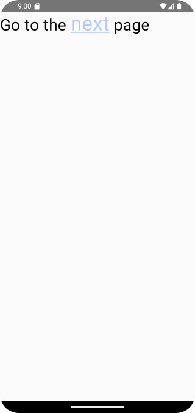
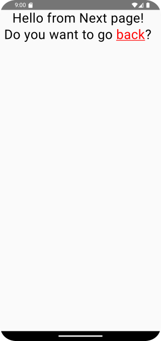

# Домашнее задание по теме" "AnnotatedString"
## Приложение «Второй экран»

На основе пройденного материала необходимо написать приложение для перехода на второй 
экран с использованием стилизации к сегменту текста и по нажатию на этот 
сегмент будет выполняться переход на следующий экран. Переход можно выполнить 
через `Intent`.

При создании второго класса необходимо его прописать в файле манифеста.

Кроме того, для реализации работы этого приложения необходимо самостоятельно 
изучить и интегрировать функцию `withLink` с имеющимся параметром, который позволяет 
обрабатывать нажатие элемента, например,

``` Kotlin

link = LinkAnnotation.Clickable(
    tag = "",
    linkInteractionListener = { 
        /* логика обработки нажатия */
    },
    styles = /* ... */ )

```

В параметре `styles` выполняется стилизация сегмента текста. 
Сегмент должен быть подчеркнут и выделен другим цветом.

Примерный вариант отображения содержимого может выглядеть так:


Первый экран


Второй экран

Приложение необходимо сохранить проектом в удаленном репозитории, для проверки качества предоставить ссылку преподавателю, либо сделать скрины эмулятора при каждом шаге работы приложения или снять видео экрана при работе приложения.

## Скриншоты домашнего задания по теме" "AnnotatedString"


